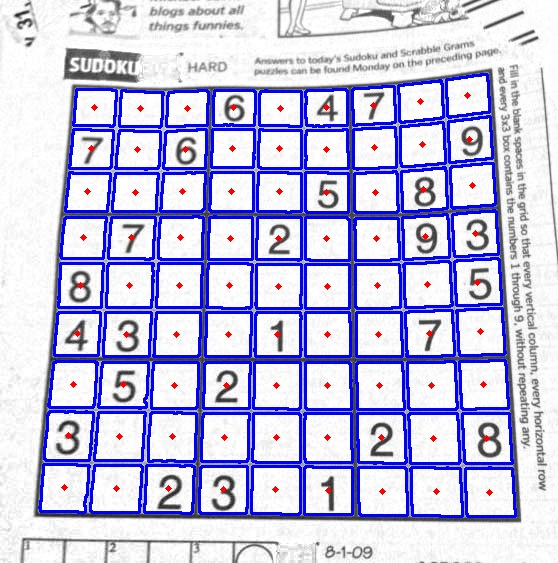

# Detect sudoku board on images

## Build project
Build project with cmake:
```
cd build
cmake -DCMAKE_BUILD_TYPE=Release ..
make
```

## Run project
Run sudoku detection:
```
./sudoku_detection <image_file>
```

Example:
```
./sudoku_detection sample_images/00.jpg
```

The result will look like this:
<p align="center">
    
</p>
